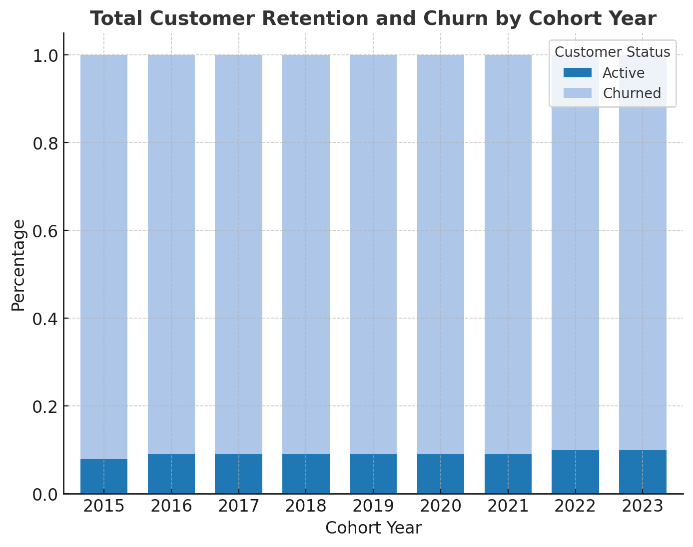

# Intermediate SQL – Sales Analysis

## Overview
Analysis of customer behavior, retention, and lifetime value for an e-commerce company to improve customer retention and maximize revenue.

## Business Questions
- **Customer Segmentation:** Who are our most valuable customers?  
- **Cohort Analysis:** How do different customer groups generate revenue?  
- **Retention Analysis:** Which customers haven't purchased recently?

## Clean Up Data

🖥️ **Query:** [0_cohort_analysis_view.sql](Scripts/0_cohort_analysis_view.sql)
- Aggregated sales and customer data into revenue metrics  
- Calculated first purchase dates for cohort analysis  
- Created view combining transactions and customer details

## Analysis

### 1. Customer Segmentation

🖥️ **Query:** [1_customer_segmentation.sql](Scripts/1_customer_segmentation.sql)
- Categorized customers based on total lifetime value (LTV)  
- Assigned customers to High, Mid, and Low-value segments  
- Calculated key metrics like total revenue  

📈 **Visualization:**  

📊 **Key Findings:**
- High-value segment (25% of customers) drives **66%** of revenue ($135.4M)  
- Mid-value segment (50% of customers) generates **32%** of revenue ($66.6M)  
- Low-value segment (25% of customers) accounts for **2%** of revenue ($4.3M)  

💡 **Business Insights:**
- **High-Value (66% revenue):** Offer premium membership program to 12,372 VIP customers  
- **Mid-Value (32% revenue):** Create upgrade paths through personalized promotions (potential $66.6M → $135.4M)  
- **Low-Value (2% revenue):** Design re-engagement campaigns and price-sensitive promotions

---

### 2. Customer Revenue by Cohort

🖥️ **Query:** [2_cohort_analysis.sql](/Scripts/2_cohort_analysis.sql)

- Tracked revenue and customer count per cohort  
- Cohorts were grouped by year of first purchase  
- Analyzed customer revenue at a cohort level  

📈 **Visualizations:**  
 

📊 **Key Findings:**
- Older cohorts (2016–2018) spent ~$2,800+, while 2024 cohort spending dropped to ~$1,970  
- Revenue and customers peaked in 2022–2023 but are trending downward in 2024  
- High volatility with sharp drops in 2020 and 2024 signals retention challenges  

💡 **Business Insights:**
- Target recent cohorts (2022–2024) with personalized offers to prevent churn  
- Introduce loyalty programs/subscriptions to stabilize revenue  
- Apply strategies from high-spending 2016–2018 cohorts to newer ones

---

### 3. Customer Retention

🖥️ **Query:** [3_retention_analysis.sql](Scripts/3_retention_analysis.sql)
- Identified customers at risk of churning  
- Analyzed last purchase patterns  
- Calculated customer-specific metrics  

📈 **Visualization:**  

📊 **Key Findings:**
- Churn stabilizes at ~90% after 2–3 years  
- Retention is low (8–10%) across all cohorts — systemic issue  
- Newer cohorts show similar churn patterns  

💡 **Business Insights:**
- Strengthen engagement in first 1–2 years (onboarding incentives, loyalty rewards)  
- Run win-back campaigns for high-value churned customers  
- Predict & preempt churn risk with warning indicators and proactive intervention  

---

## Strategic Recommendations

### Customer Value Optimization (Customer Segmentation)
- Launch VIP program for 12,372 high-value customers (66% revenue)  
- Create personalized upgrade paths for mid-value segment ($66.6M → $135.4M)  
- Design price-sensitive promotions for low-value segment

### Cohort Performance Strategy (Customer Revenue by Cohort)
- Target 2022–2024 cohorts with personalized re-engagement offers  
- Implement loyalty/subscription programs  
- Apply successful strategies from 2016–2018 to new cohorts

### Retention & Churn Prevention (Customer Retention)
- Strengthen first-year engagement with onboarding and rewards  
- Focus win-back campaigns on high-value churned customers  
- Build proactive system for at-risk customers

---

## Technical Details
- **Database:** PostgreSQL  
- **Analysis Tools:** PostgreSQL, DBeaver  
- **Visualization:** ChatGPT-generated static charts